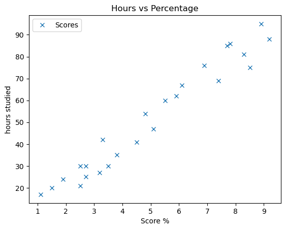
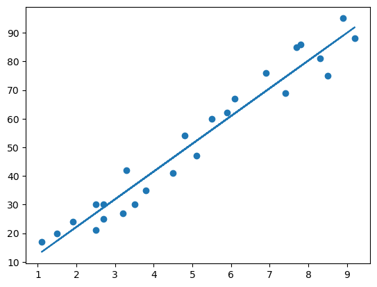

## 1-Importing Data And Initial Exploring


```python
import numpy as np
import pandas as pd
import matplotlib.pyplot as plt

%matplotlib inline
```


```python
# importing data and exploring
df = pd.read_csv('./student_scores.csv')
print(df.shape)
print(df.describe())
df.head()
```

    (25, 2)
               Hours     Scores
    count  25.000000  25.000000
    mean    5.012000  51.480000
    std     2.525094  25.286887
    min     1.100000  17.000000
    25%     2.700000  30.000000
    50%     4.800000  47.000000
    75%     7.400000  75.000000
    max     9.200000  95.000000


<div>
<style scoped>
    .dataframe tbody tr th:only-of-type {
        vertical-align: middle;
    }

    .dataframe tbody tr th {
        vertical-align: top;
    }

    .dataframe thead th {
        text-align: right;
    }
</style>
<table border="1" class="dataframe">
  <thead>
    <tr style="text-align: right;">
      <th></th>
      <th>Hours</th>
      <th>Scores</th>
    </tr>
  </thead>
  <tbody>
    <tr>
      <th>0</th>
      <td>2.5</td>
      <td>21</td>
    </tr>
    <tr>
      <th>1</th>
      <td>5.1</td>
      <td>47</td>
    </tr>
    <tr>
      <th>2</th>
      <td>3.2</td>
      <td>27</td>
    </tr>
    <tr>
      <th>3</th>
      <td>8.5</td>
      <td>75</td>
    </tr>
    <tr>
      <th>4</th>
      <td>3.5</td>
      <td>30</td>
    </tr>
  </tbody>
</table>
</div>


```python
# Plotting variables and checking correlation
df.plot(
    x='Hours',
    y='Scores',
    style='x',
    xlabel='Score %',
    ylabel='hours studied',
    title='Hours vs Percentage'
)

print(df.corr())
```

               Hours    Scores
    Hours   1.000000  0.976191
    Scores  0.976191  1.000000


    

    


> There is a strong positive correlation of 97.6% between the 2 variables

## 2- Creating Train and Test Dastasets


```python
X = df.iloc[:,:-1].values
y = df.iloc[:,-1].values
```


```python
from sklearn.model_selection import train_test_split
from sklearn.linear_model import LinearRegression
from sklearn.metrics import mean_absolute_error as MSE
```


```python
X_train, X_test, y_train, y_test = train_test_split(
    X,
    y,
    test_size=0.2,
    random_state=42
)
```


```python
model = LinearRegression()
model.fit(X_train, y_train)
```


    LinearRegression()


```python
# ploting Regression line and test data

plt.scatter(X,y)
plt.plot(X, ((model.coef_ * X) + model.intercept_)) # y=mx+c
```


    [<matplotlib.lines.Line2D at 0x7fd4e911c730>]


    

    


## 3-Predictions 


```python
y_pred = model.predict(X_test)
```


```python
pd.DataFrame({'Actual':y_test, 'predicted':y_pred})
```


<div>
<style scoped>
    .dataframe tbody tr th:only-of-type {
        vertical-align: middle;
    }

    .dataframe tbody tr th {
        vertical-align: top;
    }

    .dataframe thead th {
        text-align: right;
    }
</style>
<table border="1" class="dataframe">
  <thead>
    <tr style="text-align: right;">
      <th></th>
      <th>Actual</th>
      <th>predicted</th>
    </tr>
  </thead>
  <tbody>
    <tr>
      <th>0</th>
      <td>81</td>
      <td>83.188141</td>
    </tr>
    <tr>
      <th>1</th>
      <td>30</td>
      <td>27.032088</td>
    </tr>
    <tr>
      <th>2</th>
      <td>21</td>
      <td>27.032088</td>
    </tr>
    <tr>
      <th>3</th>
      <td>76</td>
      <td>69.633232</td>
    </tr>
    <tr>
      <th>4</th>
      <td>62</td>
      <td>59.951153</td>
    </tr>
  </tbody>
</table>
</div>


```python
MSE(y_test, y_pred)
```


    3.9207511902099244


## 4- Predicting Score For 9.25 Hours


```python
prediction = model.predict(np.array(9.25).reshape(1,-1))

print('for studying for 9.25 hours it is predicted to score: ' + str(round(*prediction,2)) + '%')
```

    for studying for 9.25 hours it is predicted to score: 92.39%

